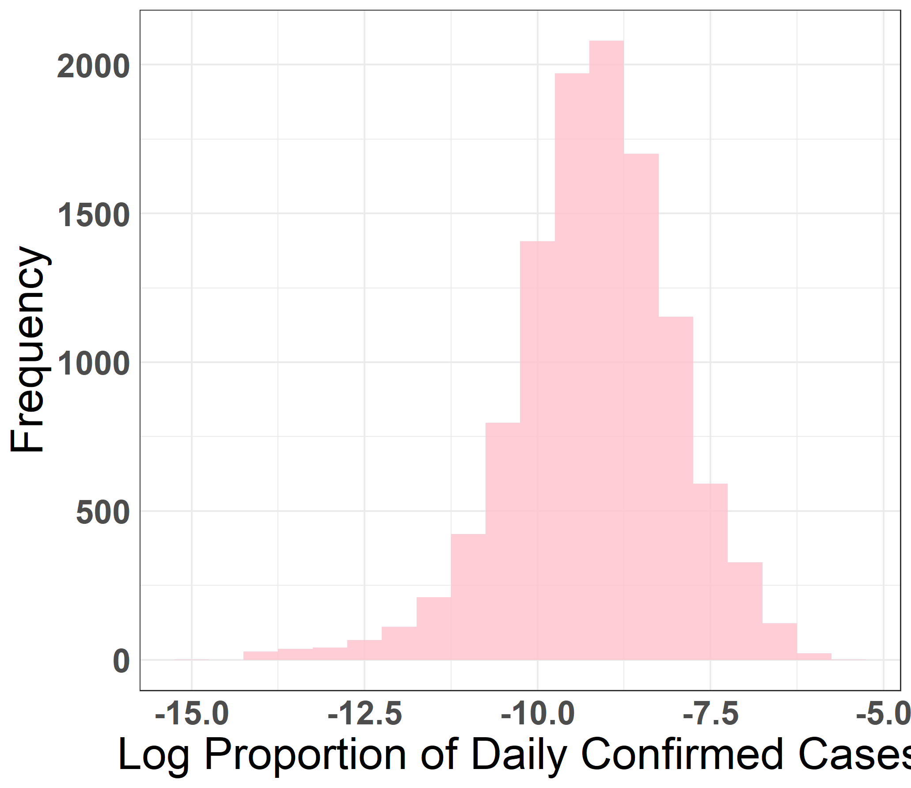

```{r setup, echo=FALSE, warning=FALSE}
knitr::opts_chunk$set(
	fig.align = "center",
	message = FALSE,
	include = FALSE,
	results = "asis"
)
library(knitr)
library(png)
library(grid)
```

# Introduction

In 2020, COVID-19 has become a serious pandemic and influenced millions of people’s lives. As of December 5, 2020, there are about 14.3 million confirmed cases of the COVID-19 in the United States and 278,000 confirmed deaths as a result of it. As the number of confirmed cases and deaths show an increasing trend since the beginning of 2020, it is crucial to attempt to identify methods for combating the disease. Our team believes that the mask mandate in each state would be a possible effective method of combating the COVID-19 For the purpose of our study, the proportion of confirmed cases in the state to the recorded population of the state will be used as the response variable to describe the prevalence of COVID-19 in a particular state. 

# Research Question
We want to know whether the presence of a state-wide mask mandate is correlated with the overall number of Coronavirus cases in the state. We hypothesize that a state-wide mask mandate is correlated with a lower number of overall cases.

# Data 

Our data is publicly provided by JSU CSSE, who is unaffiliated with this analysis. The original data was in the form of CSV files, each one containing daily observational data for $60$ states and provinces in the United States ranging from April $4, 2020$ to the present day. 

We read and formatted the data using the Pandas Python library \cite{pandas}. We first combined all CSV data into a single dataframe, keeping only the $50$ states and observations before October $23$. This resulted in $11500$ rows and $14$ columns. The column data included attributes such as state name, timestamps, confirmed cases, deaths, and hospitalization rates. Note that this data is time series data, thus we will need to perform tasks such as differencing and re-coding the timestamps.

Next, we imputed missing values in the form of NAs. Imputation was done with Python's scikit-learn \cite{scikit-learn} KNN imputer with $k = 10$ to avoid losing data. Because attributes such as confirmed cases and deaths are cumulative, we then differenced the numeric attributes by subtracting the current value from that of the previous day and setting the initial value at $0$. Finally, we divided numeric attributes by the state’s population

# Methods

We utilized an ordinary linear regression(OLS) model to investigate the significance of the mask mandate variable when predicting a state’s proportion of confirmed cases and proportion of daily new cases. The cumulative proportion of cases is shown to be approximately normal through a Q-Q plot, and the proportion of daily new cases required a log transformation.

<center>  
  
{height=900px}

</center>

<center>  
  
{height=900px}

</center>

# Results

Setting the proportion of confirmed cases as the independent variable and mask mandate as the dependent variable, we determined that the mask mandate variable was significant($p < 0.01$). Diagnostic plots showed that the data was approximately normal, and no assumptions were blatantly violated. 

Next, we considered the number of daily new cases per state for a total of $11500$ data points. Because this attribute was heavily skewed, we performed a log transformation, excluding any non-positive rows for a total of $11087$ remaining rows. A linear regression model found that the mask variable was highly significant($p < 0.001$) with a reverse transformed slope of $0.72$. This can be interpreted as a 28% reduction in a state’s proportion of daily new cases if it has a state-wide mask mandate.

<center>  
  
{height=900px}

</center>


# Conclusion

Through the analysis using ordinary linear regression model to investigate the significance of the mask mandate attribute when predicting a state’s proportion of confirmed cases, we deemed the mask mandate to be a significant predictor (p < 0.01). The slope of the regression line was -1.79, indicating that the presence of a mask mandate led to a decrease in the predicted proportion of a state’s confirmed cases of around 1.8%, supporting our hypothesis that the presence of a mask mandate is an effective method of combating the Coronavirus disease. 

Besides the presence of a mask mandate in the state, we are interested in investigating other possible predictors of a state’s proportion of confirmed cases, such as the political affiliation of the state or the presence of state-wide curfews. We are also interested in investigating other predictors of the Coronavirus disease that may not be particularly associated with state differences, such as the seasonality.


  
# References

